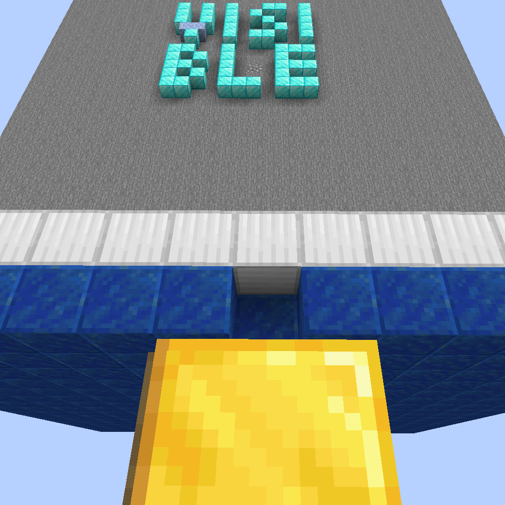

Occlusion Culling Fix
=====

[Download me on CurseForge](https://www.curseforge.com/minecraft/mc-mods/occlusion-culling-temp-fix)

This is a mod which "fixes" MC-70850 for MC1.15.2 by disabling Occlusion Culling.

Relations
-----

**Requires** [MixinBootstrap](https://www.curseforge.com/minecraft/mc-mods/mixinbootstrap): For loading Mixins.

Effect
-----

The chunk with letters "VISIBLE" in it is hidden in vanilla because of [MC-70850](https://bugs.mojang.com/browse/MC-70850). You can get the test map for the bug by clicking the link above.

Side Effects
-----

This is a temp fix which fixes the bug by breaking features. The side effect of the mod is reducing FPS, but the performance impact should not be as bad as expected.

Related Information
-----

This fixes MC-70850 only. Another issue, [MC-63020](https://bugs.mojang.com/browse/MC-63020) causes a similar issue, but it's fixed by [Optifine](https://optifine.net/downloads).

Incompatibilities
-----

Not found so far.

*Details:* This mod uses Mixins to `@Overwrite` `net.minecraft.client.renderer.chunk.VisGraph#computeVisibility`. However, it is not expected to break any other mods. If another mod patches this too, "it's abusing core modding".

Plans
-----

New features will not be added to the mod in order to keep the name descriptive. Please use [Github Issue Tracker](http://github.com/yezhiyi9670/occlusion-culling-fix/issues) to report bugs. DO NOT report bugs using CurseForge comment as comments may not be responsed.

The mod WILL NOT be backported to MC1.14.4 and earlier. If you are the lucky one who is playing MC1.12.2, use [EigenCraft Unofficial Patches](https://github.com/mrgrim/MUP) instead.
